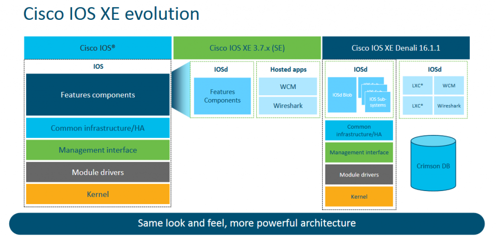

## Overview IOS-XE

<p align="center">

</p>

#### Introduction 
* Cisco IOS (Internetwork Operating System)
* Cisco IOS XE is a modern, Linux-based network operating system for Cisco routers, switches, and wireless controllers
* Combining the familiar Cisco IOS CLI with a Linux kernel

#### Information
* [Overview IOS-XE](#overview-isoxe)
* [Basic Configuration](#basic-configuration)
* [OSPF Routing Configuration](#ospf-routing-configuration)
* [MPLS (Multi Protocol Labeling Switching)](#mpls-multi-protocol-labeling-switching)
* [MPLS L2VPN Configuration](#mpls-l2vpn-configuration)
* [VPLS Configuration](#vpls-configuration)
* [Interior-BGP Route Reflector](#interior-bgp-route-reflector)
* [MPLS L3VPN Configuration](#mpls-l3vpn-configuration)
* [SVI (Switch Virtual Instance)](#svi-switch-virtual-instance)
* [LACP (Link Aggregation Control Protocol)](#lacp-link-aggregation-control-protocol)
* [Switch Configuration (IOS-L)](#switch-configuration-ios-l) - Bonus
* [Command Refrences](#command-refrences)
  
## Basic Configuration
#### 1. Hostname
```
hostname [HOSTNAME]
```

#### 2. Password Enable
```
enable secret [PASSWORD]
```

#### 3. Password Encryption
```
service password-encryption
```

#### 4. Username and Password
```
username [USERNAME] privilege 15 secret [PASSWORD]
```

#### 5. Privilege Login
* 0 - 4
```
line vty 0 4
login local
transport input telnet ssh
transport output telnet ssh
```

* 5 - 15
```
line vty 5 15
transport input none
transport output none
```

* Console
```
line console
login local
transport input telnet ssh
transport output telnet ssh
```

#### 6. Time Clock
```
clock timezone WIB 7 0
```

#### 7. Spanning-Tree
```
spanning-tree mode mst
spanning-tree loopguard default
spanning-tree logging
spanning-tree extend system-id
spanning-tree mst 0 priority 4096
```

#### 8. FTP (File Transfer Protocol)
```
ip ftp source-interface Loopback0
ip ftp username [USERNAME]
ip ftp password 7 [PASSWORD]
```

#### 9. UDLD ((Unidirectional Link Detection)
```
udld enable
```

#### 10. CDP (Cisco Discovery Protocol)
```
cdp run
interface Gi1
cdp enable
```

#### 11. SNMP (Simple Network Management Protocol)
```
snmp-server community [SNMP-COMMUNITY]
snmp-server trap-source Loopback0
snmp-server location [SITE-ID]
snmp-server contact [EMAIL@EMAIL.COM]
snmp-server host [IP_SERVER_SNMP]
```

#### 12. NTP (Network Time Protocol0
```
ntp source Loopback0
ntp server [IP_SERVER_NTP]
ntp server [IP_SERVER_NTP]
```

#### 13. Save Configuration
* Copy Running Configuration
```
copy running startup-config
```

* Save Configuration
```
write
```

#### 14. Show Configuration
```
show running
```


## OSPF Routing Configuration
#### 1. Single Area OSPF (Internal Router)
* Loopback Interface
```
interface Loopback0
ip address [IP_ADDRESS] [NETMASK]
ip ospf network point-to-point
```

* Interface
```
interface GigabitEthernet1
no shutdown
description [DESCRIPTION]
mtu [1500-9200]
load-interval 30
negotiation auto
cdp enable
ip address  [IP_ADDRESS] [NETMASK]
ip ospf authentication message-digest
ip ospf message-digest-key 1 md5 [PASSWORD]
ip ospf network point-to-point
ip ospf dead-interval 15
ip ospf hello-interval 5
ip ospf mtu-ignore
ip ospf cost [1-65000]
```

* Single Area Configuration
```
router ospf [OSPF-ID]
router-id [IP_LOOPBACK]
network [IP_LOOPBACK] 0.0.0.0 area [OSPF_AREA]
network [IP_POINT_TO_POINT] 0.0.0.0 area [OSPF_AREA]
```

* Verification
```
show ip ospf interface
show ip ospf interface brief
show ip ospf interface neighbor 
```

#### 2. Multi Area OSPF (Area Border Router)
* Multi Area Configuration
```
router ospf [OSPF-ID]
router-id [IP_LOOPBACK]
network [IP_LOOPBACK] 0.0.0.0 area [OSPF_AREA_A]
network [IP_POINT_TO_POINT] 0.0.0.0 area [OSPF_AREA_A]
network [IP_POINT_TO_POINT] 0.0.0.0 area [OSPF_AREA_B]
network [IP_POINT_TO_POINT] 0.0.0.0 area [OSPF_AREA_C]
```

* Verification
```
show ip ospf interface
show ip ospf interface brief
show ip ospf interface neighbor 
```

#### 3. OSPF Advance Configuration
```
router ospf [OSPF-ID]
nsf cisco
passive-interface default <- Passive Port
no passive-interface GigabitEthernet1 <- Active Port
no passive-interface GigabitEthernet2 <- Active Port
```

## MPLS (Multi Protocol Labeling Switching)
#### 1. MPLS
* MPLS in OSPF 
```
router ospf [OSPF-ID]
router-id [IP_LOOPBACK]
mpls ldp sync
mpls traffic-eng router-id Loopback0
mpls traffic-eng area 262
```

* MPLS in Port Interface
```
interface [Port]
mpls ip
mpls label protocol ldp
mpls traffic-eng tunnels
```

* MPLS Configuration Advanced Example
```
interface GigabitEthernet1
no shutdown
description [DESCRIPTION]
mtu [1500-9200]
load-interval 30
negotiation auto
cdp enable
ip address  [IP_ADDRESS] [NETMASK]
ip ospf authentication message-digest
ip ospf message-digest-key 1 md5 [PASSWORD]
ip ospf network point-to-point
ip ospf dead-interval 15
ip ospf hello-interval 5
ip ospf mtu-ignore
ip ospf cost [1-65000]
mpls ip
mpls label protocol ldp
mpls traffic-eng tunnels
ip rsvp bandwidth
```

* Verification
```
show mpls interface
show mpls ldp session
show mpls ldp neighbor
```

#### 2. MPLS LDP (Link Distribution Protocol)
```
mpls label protocol ldp
mpls ldp graceful-restart
no mpls ldp advertise-labels
no mpls ip propagate-ttl 
mpls traffic-eng tunnels
xconnect logging pseudowire status
xconnect logging redundancy
mpls ldp neighbor [IP_LOOPBACK_NEIGHBOR] password [PASSWORD]
mpls ldp neighbor [IP_LOOPBACK_NEIGHBOR] password [PASSWORD]
```

* Verification
```
show mpls interface
show mpls ldp session
show mpls ldp neighbor
```

#### 3. RSVP (Resource Reservation Protocol)
```
interface [Port]
ip rsvp bandwidth
```

#### 4. Access Control List LDP
```
ip access-list standard ACL-MPLS-LDP
10 permit [IP_HOST_ALLOW]
20 permit [IP_HOST_ALLOW]
30 permit [IP_HOST_ALLOW]
mpls ldp advertise-labels for ACL-MPLS-LDP
```

## MPLS L2VPN Configuration
#### 1. Far End
* Service Instance
```
interface GigabitEthernet2
service instance 666 ethernet
description MPLS_L2VPN
encapsulation dot1q 666
rewrite ingress tag pop 1 symmetric
bridge-domain 666
xconnect 11.11.11.11 666 encapsulation mpls
```

* Verification
```
show mpls l2transport vc [L2VPN-ID]
show bridge-domain [L2VPN_ID]
show mac-address-table dynamic vlan [VLAN_ID]
```

#### 2. Near End
* Service Instance
```
interface GigabitEthernet2
service instance 666 ethernet
description MPLS_L2VPN
encapsulation dot1q 666
rewrite ingress tag pop 1 symmetric
bridge-domain 666
xconnect 12.12.12.12 666 encapsulation mpls
```

* Verification
```
show mpls l2transport vc [L2VPN-ID]
show bridge-domain [L2VPN_ID]
show mac-address-table dynamic vlan [VLAN_ID]
```

## VPLS Configuration
#### 1. Far End
* VPLS Configuration
```
l2 vfi VFI-444 manual
vpn id 444
bridge-domain 444
mtu 1900
neighbor 21.21.21.21 encapsulation mpls
```

* Service Instance
```
interface GigabitEthernet2
service instance 444 ethernet
description VPLS_SERVICE
encapsulation dot1q 444
rewrite ingress tag pop 1 symmetric
bridge-domain 444
```

* Verification
```
show mpls l2transport vc [VPLS-ID]
show bridge-domain [VPLS_ID]
show vfi [VPLS-ID]
show mac-address-table dynamic vlan [VLAN_ID]
```

#### 2. Near End
* VPLS Configuration
```
l2 vfi VFI-444 manual
vpn id 444
bridge-domain 444
mtu 1900
neighbor 12.12.12.12 encapsulation mpls
```

* Service Instance
```
interface GigabitEthernet2
service instance 444 ethernet
description VPLS_SERVICE
encapsulation dot1q 444
rewrite ingress tag pop 1 symmetric
bridge-domain 444
```

* Verification
```
show mpls l2transport vc [VPLS-ID]
show bridge-domain [VPLS_ID]
show vfi [VPLS-ID]
show mac-address-table dynamic vlan [VLAN_ID]
```

## Interior-BGP Route Reflector
#### 1. BGP Route Reflector (Master)
* BGP RR Configuration
```
router bgp [AS_NUMBER]
bgp router-id [IP_LOOPBACK_RR]
bgp log-neighbor-changes
bgp graceful-restart
no bgp default ipv4-unicast
neighbor RR-CLIENT peer-group
neighbor RR-CLIENT remote-as [AS_NUMBER]
neighbor RR-CLIENT password [PASSWORD]
neighbor RR-CLIENT update-source Loopback0
neighbor [IP_RR_CLIENT_A] peer-group RR-CLIENT
neighbor [IP_RR_CLIENT_B] peer-group RR-CLIENT
neighbor [IP_RR_CLIENT_B] peer-group RR-CLIENT
!
address-family vpnv4
bgp slow-peer detection
neighbor RR-CLIENT send-community both
neighbor RR-CLIENT route-reflector-client
neighbor RR-CLIENT slow-peer split-update-group dynamic
neighbor [IP_RR_CLIENT_A] activate
neighbor [IP_RR_CLIENT_B] activate
neighbor [IP_RR_CLIENT_C] activate
exit-address-family
```

* Verification
```
show bgp summary
```

#### 2. BGP Router Client
* BGP Router Client
```
router bgp [AS_NUMBER]
bgp router-id [IP_LOOPBACK]
bgp log-neighbor-changes
bgp graceful-restart
no bgp default ipv4-unicast
neighbor [IP_ROUTE_REFLECTOR] remote-as [AS_NUMBER]
neighbor [IP_ROUTE_REFLECTOR] description [TO_ROUTE_REFLECTOR]
neighbor [IP_ROUTE_REFLECTOR] password [PASSWORD]
neighbor [IP_ROUTE_REFLECTOR] update-source Loopback0
!
address-family vpnv4
neighbor [IP_ROUTE_REFLECTOR] activate
neighbor [IP_ROUTE_REFLECTOR] send-community both
exit-address-family
```

* Verification
```
show bgp summary
```

## MPLS L3VPN Configuration
#### 1. Far End
* VPN Instance
```
ip vrf WAN-111
rd 65000:10100
route-target export 65000:10100
route-target import 65000:10100
```

* Multi Protocol - BGP Configuration
```
router bgp 65000
address-family ipv4 vrf WAN-111
redistribute connected
redistribute static
exit-address-family
```

* Bridge Domain Interface
```
interface BDI111
description WAN-111
ip vrf forwarding WAN-111
ip address 10.200.0.1 255.255.255.252
ip address 10.200.1.1 255.255.255.252 secondary
no shutdown
```

* Service Instance
```
interface GigabitEthernet2
service instance 111 ethernet
description MPLS_L3VPN
encapsulation dot1q 111
rewrite ingress tag pop 1 symmetric
bridge-domain 111
```

* Verification
```
show bgp vpnv4 unicast vrf [VRF_LABEL]
ping vrf [VRF_LABEL] [IP_NEIGHBOR]
traceroute vrf [VRF_LABEL] [IP_NEIGHBOR]
```

#### 2. Near End
* VPN Instance
```
ip vrf WAN-111
rd 65000:10100
route-target export 65000:10100
route-target import 65000:10100
```

* Multi Protocol - BGP Configuration
```
router bgp 65000
address-family ipv4 vrf WAN-111
redistribute connected
redistribute static
exit-address-family
```

* Bridge Domain Interface
```
interface BDI111
description WAN-111
ip vrf forwarding WAN-111
ip address 10.100.0.1 255.255.255.252
ip address 10.100.1.1 255.255.255.252 secondary
no shutdown
```

* Service Instance
```
interface GigabitEthernet2
service instance 111 ethernet
description MPLS_L3VPN
encapsulation dot1q 111
rewrite ingress tag pop 1 symmetric
bridge-domain 111
```

* Verification
```
show bgp vpnv4 unicast vrf [VRF_LABEL]
ping vrf [VRF_LABEL] [IP_NEIGHBOR]
traceroute vrf [VRF_LABEL] [IP_NEIGHBOR]
```

## SVI (Switch Virtual Instance)
* Service Instance
```
interface GigabitEthernet2
no shutdown
description Trunk to Service
mtu 1900
no ip address
load-interval 30
negotiation auto
spanning-tree bpdufilter enable
service instance 111 ethernet
description MPLS_L3VPN
encapsulation dot1q 111
rewrite ingress tag pop 1 symmetric
bridge-domain 111
```

* VLAN Dot1.Q
```
interface GigabitEthernet2.111
description Trunk to Service
mtu 1900
no ip address
load-interval 30
negotiation auto
spanning-tree bpdufilter enable
xconnect 11.11.11.11 666 encapsulation mpls
```

* Verfication
```
show running interface [PORT]
show mac-address-table dynamic vlan [ID]
show bridge-domain [ID]
```

## LACP (Link Aggregation Control Protocol)
* LACP Configuration
```
interface Port-channel1
ip address 192.168.1.1 255.255.255.0
```

* Port Interface
```
interface GigabitEthernet0/1
switchport
switchport mode trunk
channel-group 1 mode active
```
```
interface GigabitEthernet0/2
switchport
switchport mode trunk
channel-group 1 mode active
```

* Verification
```
show running interface [PORT]
show running interface [Port-Channel]
show etherchannel summary
show mac-address-table dynamic vlan [VLAN_ID]
```

## Switch Configuration (IOS-L)
#### 1. VLAN Configuration
* VLAN
```
vlan [VLAN_ID]
vlan name [VLAN_NAME]
```

* Interface VLAN
```
interface vlan [VLAN_ID]
description [SERVICE_NAME]
ip address [IP_ADDRESS] [NETMASK]
no shutdown
```

* Verification
```
show running interface [vlan]
show vlan
```

#### 2. Port Trunk
* Port Trunk
```
interface GigabitEthernet [PORT_TRUNK]
description Trunk to 11-CE
switchport trunk allowed vlan 111,444,666
switchport trunk encapsulation dot1q
switchport mode trunk
```

* Advanced Port Trunk
```
interface GigabitEthernet [PORT_TRUNK]
description Trunk to 11-CE
switchport trunk allowed vlan 111,444,666
switchport trunk encapsulation dot1q
switchport mode trunk
cdp enable
mtu 1900
load-interval 30
negotiation auto
udld port disable
spanning-tree bpdufilter enable
ip dhcp snooping trust -> Optional
```

* Verification
```
show running interface [PORT]
show vlan
show mac-address-table dynamic vlan [VLAN_ID]
```

#### 3. Port Access
* Port Access
```
interface GigabitEthernet [PORT_ACCESS]
description Access to A-CPE
switchport access vlan 444
switchport mode access
```

* Advanced Port Access
```
interface GigabitEthernet [PORT_ACCESS]
description Access to A-CPE
switchport access vlan 444
switchport mode access
cdp enable
mtu 1900
load-interval 30
negotiation auto
udld port disable
spanning-tree bpdufilter enable
ip dhcp snooping trust -> Optional
```

* Verification
```
show running interface [PORT]
show vlan
show mac-address-table dynamic vlan [VLAN_ID]
```

#### 4. Static Routing
* Static Route
```
router(config)# ip route 0.0.0.0 0.0.0.0 [GATEWAY]
router(config)# ip route [NETWORK_NEIGHBOR] [PREFIX] [GATEWAY]
```

* Verification
```
show route table
```

## Command Refrences

| Command | Description |
| ---- | ----- |
| show running | show configuration in router |
| show running interface [PORT] | show configuration interface |
| show running \| section router ospf | show configuration ospf |
| show running \| section router bgp | show configuration bgp |
| show running interface [PORT] | show configuration interface |
| show running interface [PORT_TRUNK] \| section [ID_SERVICE] ethernet | show configuration service instance |
| show running interface bridge-domain [ID_SERVICE] | show configuration interface bridge-domain |
| show route table | show routing table |
| show vlan | show vlan configuration |
| show mac-address-table dynamic vlan [VLAN_ID] | show mac address in vlan |
| show interface [PORT_TRUNK] | show interface port trunk |
| show ip interface brief | show ip all interface |
| show etherchannel summary | etherchannel summary |
| show ip ospf interface | show ospf interface |
| show ip ospf interface brief | show ospf all interface |
| show ip ospf interface neighbor | show ospf neighbor connected |
| show bridge-domain [VPLS_ID] | show bridge-domain vpls |
| show bridge-domain [L2VPN_ID] | show bridge-domain l2vpn |
| show mpls interface | show mpls interface |
| show mpls ldp session | show ldp session |
| show mpls ldp neighbor | show ldp neighbor connected |
| show mpls l2transport vc [VPLS-ID] | show l2transport virtual connection vpls |
| show mpls l2transport vc [L2VPN-ID] | show l2transport virtual connection l2 |
| show vfi [VPLS-ID] | show vpls configuration |
| show bgp summary | show bgp all connected |
| show bgp vpnv4 unicast vrf [VRF_LABEL] | show vrf MP-BGP configuration |
| telnet [IP_ADDRESS] | telnet access to router |
| ssh [USERNAME]@[IP_ADDRESS] | ssh access to router |
| ping [IP_GATEWAY] | ping point to point |
| ping vrf [VRF_LABEL] [IP_NEIGHBOR] | ping vpn to destination |
| traceroute vrf [VRF_LABEL] [IP_NEIGHBOR] | traceroute vpn to destination |
| copy running startup-config | save configuration in startup router |
| write | save configuration |


## Support

* [:octocat: Follow me on GitHub](https://github.com/anggrdwjy)
* [🔔 Subscribe me on Youtube](https://www.youtube.com/@anggarda.wijaya)


#### Bugs

Please open an issue on GitHub with as much information as possible if you found a bug.
* Your IOS-XE and Software Update
* All the logs and message outputted
* etc
